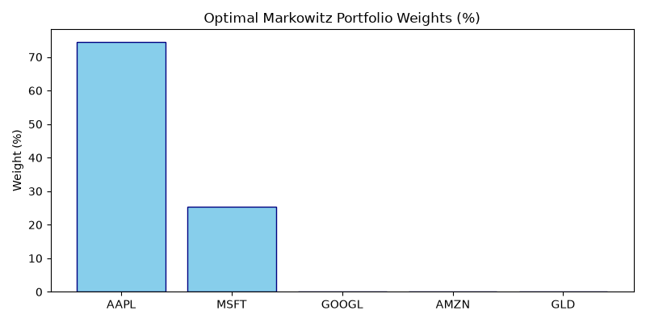

# Quantitative Studies & Management Science Analytics Pipeline

*Automated model execution timestamp:* **2026-11-27 18:01:53 UTC**

## 📊 1. Quantitative Portfolio Optimization (Markowitz Model)
- **Target Assets:** `AAPL, MSFT, GOOGL, AMZN, GLD`
- **Expected Annual Return:** `26.88%`
- **Annualized Volatility:** `22.53%`
- **Sharpe Ratio (Risk-Free Rate 4%):** `1.02`

### Optimal Asset Allocation

| Ticker | Optimal Weight |
|--------|----------------|
| **AAPL** | `86.35%` |
| **MSFT** | `13.65%` |
| **GOOGL** | `0.00%` |
| **AMZN** | `0.00%` |
| **GLD** | `0.00%` |

---

## 🏭 2. Management Science: Supply Chain Network Optimization
- **Problem Statement:** Minimum Cost Flow Linear Program
- **Calculated Minimum Logistics Cost:** `$11,700.00`

---
*Powered by Python (`scipy`, `yfinance`) and GitHub Actions.*
